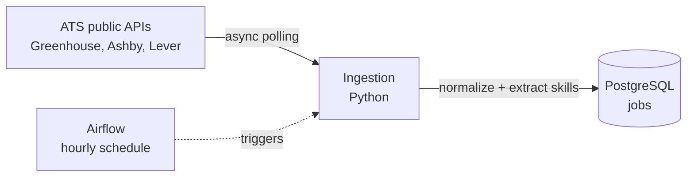

# Job Market Pipeline

**Job Market Pipeline** is a data engineering project that ingests tech job postings from public ATS feeds, tracks how they change over time, and turns raw job descriptions into queryable data about in-demand skills, roles, and location.

Not a job board — the ingestion, persistence, and analytics layer underneath one.

## Architecture



## How it works

1. **Fetch** — concurrently polls each company's public ATS API (`httpx.AsyncClient` + `asyncio.gather`).
2. **Normalize** — each ATS (Greenhouse, Ashby, Lever) returns a differently-shaped JSON response; a per-ATS adapter maps each into one common schema.
3. **Enrich** — extracts a job's tech skills from its description using a curated, data-informed keyword dictionary.
4. **Load** — batched, idempotent upsert into PostgreSQL, keyed on `(source, external_id)`. Re-running the pipeline updates existing jobs instead of duplicating them.
5. **Track changes** — jobs missing from a successful run (and not seen since) are marked closed; jobs that reappear are automatically reopened.
6. **Schedule** — Apache Airflow runs the pipeline automatically on an hourly schedule, containerized alongside Postgres.

## Data sources

Public, unauthenticated ATS APIs — the same endpoints a company's own careers page calls in the browser:

| ATS | Endpoint |
|-----|----------|
| Greenhouse | `boards-api.greenhouse.io/v1/boards/{slug}/jobs` |
| Ashby | `api.ashbyhq.com/posting-api/job-board/{slug}` |
| Lever | `api.lever.co/v0/postings/{slug}` |

LinkedIn, Indeed, and boards without a public API are intentionally excluded — scraping them isn't allowed under their terms of use.

## Design decisions

- **Performance:** sequential ingestion took ~93s for 20 companies. Concurrent fetching (`asyncio.gather`) plus batched database writes (`psycopg.executemany`) brought this to ~4.5s.
- **Idempotency:** every job is keyed on `(source, external_id)`; `first_seen_at` is set once and never overwritten, while `last_seen_at` updates on every run — the basis for change detection.
- **Change data capture:** a job is marked closed only if it's missing from a run where its *source succeeded* — a failed fetch never causes false mass-closures.
- **Skill extraction:** a curated ~30-term dictionary, informed by frequency analysis over the real dataset rather than guessed from memory; whole-word, case-insensitive matching. A production system would likely use a formal taxonomy (e.g. ESCO) or NER instead.
- **Raw data is preserved.** Each row stores the full original API response (`raw_json`, `jsonb`) alongside normalized fields, so nothing is lost for future enrichment.
- **Ingest broadly, filter later.** All roles from all companies are ingested; filtering happens at query time, not ingestion time.

## Project structure

```
job-market-pipeline/
├── config/
│   └── sources.csv          # companies to poll: company, ats, slug
├── dags/
│   └── job_pipeline_dag.py  # Airflow DAG, hourly schedule
├── sql/
│   └── schema.sql
├── src/
│   ├── ingestion/
│   │   ├── fetch.py         # per-ATS URL building + async fetching
│   │   ├── normalize.py     # per-ATS adapters -> common schema
│   │   ├── db.py            # Postgres connection + batched upsert
│   │   └── main.py          # entry point
│   ├── enrich/
│   │   └── skills.py        # description cleaning + skill extraction
│   └── analytics/
│       └── new_jobs.py      # query: jobs opened in the last N hours
├── docker-compose.yml
├── Dockerfile.airflow
├── requirements.txt
└── .env.example
```

## Getting started

Requirements: Docker Desktop, Python 3.11+.

```bash
git clone https://github.com/<your-username>/job-market-pipeline.git
cd job-market-pipeline

python -m venv venv
venv\Scripts\activate          # Windows
pip install -r requirements.txt

cp .env.example .env           # fill in local DB credentials
```

Start Postgres and Airflow:

```bash
docker compose up --build
```

Create the schema (first run only):

```bash
docker exec -it job-market-pipeline-postgres-1 psql -U jobs -d jobs
# paste the contents of sql/schema.sql, then \q
```

Airflow UI: [http://localhost:8080](http://localhost:8080) (`admin` / `admin`) — the `job_market_ingestion` DAG runs hourly once unpaused.

Or run ingestion manually, without Airflow:

```bash
python -m src.ingestion.main
```

## Status

Core pipeline complete: multi-source ingestion, idempotent storage, change data capture, skill extraction, and hourly scheduling via Airflow. Analytics dashboard and cloud deployment are next.